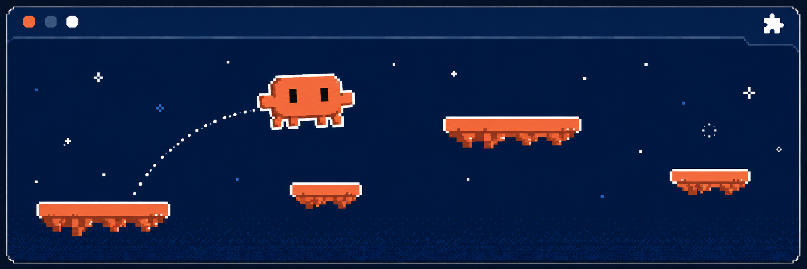
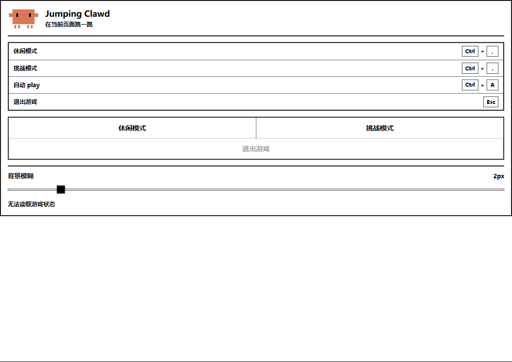
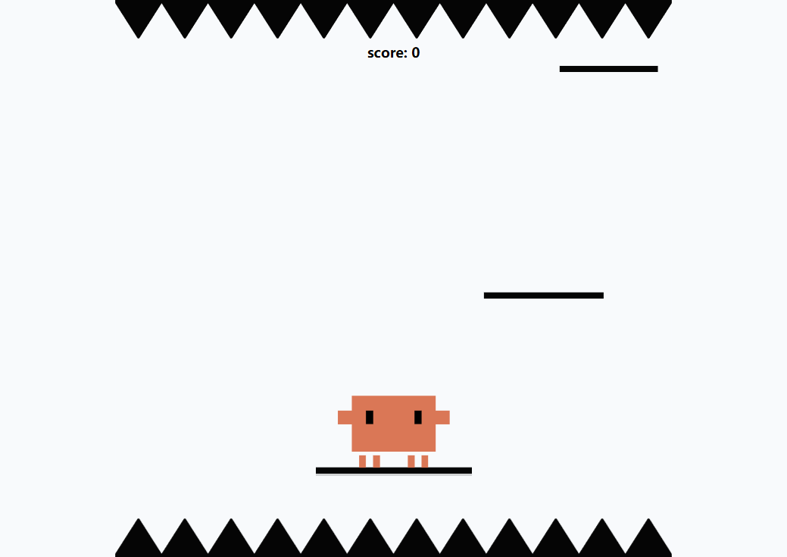
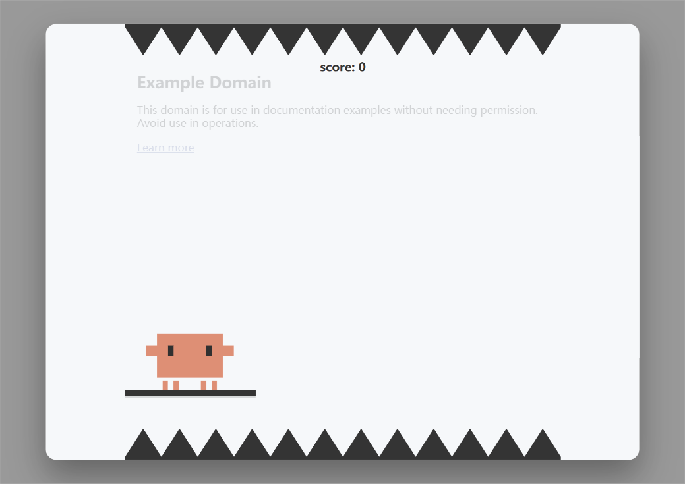
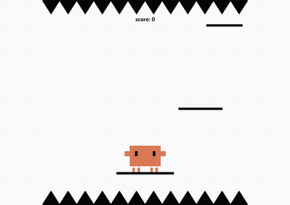

<p align="center">
  <h1 align="center">Jumping Clawd</h1>
  <p align="center"><strong>网页等待时，来局跳一跳 🦀</strong></p>
</p>

<p align="center">
  
</p>

<p align="center">
  
  
  
</p>

<p align="center">
  <a href="#-highlights-亮点聚焦">亮点</a> ·
  <a href="#-origin-起源">起源</a> ·
  <a href="#-progress-进程">进度</a> ·
  <a href="#-repo-structure-仓库结构">结构</a> ·
  <a href="#-workflow-工作流">工作流</a> ·
  <a href="#-judge-判断">判断</a> ·
  <a href="#-link-关键链接">链接</a>
</p>

## ✨ Highlights (亮点聚焦)

- **🎮 随时开玩**：在当前网页上以遮罩层启动，或在空白页/新标签页打开独立游戏页
- **🕹️ 双模式体验**：
  - 休闲模式：死亡后原地复活，轻松刷分
  - 挑战模式：底部尖刺 + 持续下漂，死亡即结算并上榜
- **🤖 自动 Play**：`Ctrl + A` 一键开启，AI 自动计算安全蓄力并释放
- **🏆 在线排行榜**：基于 Supabase，挑战模式结束后可提交成绩
- **⌨️ 快捷键直达**：`Ctrl + ,` 休闲模式、`Ctrl + .` 挑战模式、`Esc` 退出
- **🔧 基于 WXT**：现代浏览器扩展开发框架，支持 Chrome / Firefox 双平台

## 🖼️ Screenshots (界面预览)

### 扩展弹窗



### 独立游戏页



### 网页遮罩层

> 在任意网页上以半透明遮罩 + iframe 形式启动，不跳转、不打断浏览流。



### 玩法演示



## 🌱 Origin (起源)

这个项目起源于一个常见的浏览器使用场景：**等待**。

等网页加载、等会议开始、等 API 响应、等别人回消息——这些碎片时间往往只有几十秒到几分钟，既不够开一局复杂游戏，又不够专注做其他事。Jumping Clawd 想做的，就是给这些间隙一个零门槛的消遣：

打开网页，按个快捷键，跳两下。

Clawd 是一只像素风的小螃蟹方块，名字来自 "Claw"（爪子）+ "Cloud" 的谐音。它不会问你存档，不会弹出登录，只在你需要打发一分钟的时候出现。

## 📊 Progress (进程)

| 模块 | 状态 | 说明 |
|------|:----:|------|
| 游戏核心玩法 | ✅ 已完成 | 蓄力跳跃、平台生成、碰撞判定、双模式逻辑 |
| 角色动画系统 | ✅ 已完成 | 蓄力下蹲、起跳拉伸、滞空、落地挤压、手臂摆动、残影 |
| 扩展入口 | ✅ 已完成 | 后台脚本、弹窗 UI、网页遮罩层、快捷键 |
| 排行榜 | ✅ 已完成 | Supabase 读取/提交，挑战模式结算弹窗 |
| 自动 Play | ✅ 已完成 | 休闲/挑战双模式自动蓄力与释放 |
| 响应式布局 | ✅ 已完成 | 基于舞台尺寸的动态缩放 |
| 测试与 Lint | ⬜ 未配置 | 当前无测试运行器和 linter |
| 多语言 | ⬜ 未开始 | 目前仅中文界面 |

> 当前版本：`v0.1.1`

## 📂 Repo-Structure (仓库结构)

```text
.
├── entrypoints/                  # WXT 入口文件
│   ├── background.ts             # 后台脚本：快捷键监听
│   ├── page-game-overlay.ts      # 网页遮罩层内容脚本
│   ├── game.html                 # 游戏页面
│   └── popup/                    # 扩展弹窗
│       ├── index.html
│       ├── main.ts
│       └── style.css
├── src/
│   ├── extension/                # 扩展侧共享逻辑
│   │   ├── open-game.ts          # 打开游戏策略
│   │   ├── messages.ts           # 消息类型
│   │   └── backdrop-blur.ts      # 背景模糊设置
│   └── game/                     # 游戏主体
│       ├── app.js                # 主循环 + 状态机
│       ├── clawd-motion.js       # 角色动画
│       ├── config.js             # 可调参数
│       ├── dom.js                # DOM 引用
│       ├── leaderboard.js        # 排行榜 API
│       ├── math.js               # 数学工具
│       └── styles.css            # 游戏样式
├── public/icon/                  # 扩展图标
├── assets/banner.png             # README banner
├── wxt.config.ts                 # 扩展配置
└── package.json
```

## ⚙️ Workflow (工作流)

### 环境要求

- Node.js `>=20.12.0`
- npm

### 安装

```bash
npm install
```

### 开发

```bash
# Chrome / Chromium
npm run dev

# Firefox
npm run dev:firefox
```

### 类型检查与构建

```bash
npm run compile          # tsc --noEmit
npm run build            # Chrome 生产包
npm run build:firefox    # Firefox 生产包
npm run zip              # Chrome 打包 zip
npm run zip:firefox      # Firefox 打包 zip
```

### 加载扩展

1. 运行 `npm run dev`
2. 打开 Chrome 扩展管理页 `chrome://extensions/`
3. 开启右上角「开发者模式」
4. 点击「加载已解压的扩展程序」，选择项目根目录下的 `.output/chrome-mv3-dev/`

## 💡 Judge (判断)

几个贯穿项目的设计选择：

- **遮罩层优先**：优先在当前页面上覆盖 iframe 游玩，不跳转、不打断浏览流；只有在新标签页等空白场景才打开独立页。
- **休闲 vs 挑战**：休闲模式死亡即复活，降低挫败感；挑战模式引入尖刺和漂移，给想刷榜的玩家更高天花板。
- **自动 Play 是可切换的辅助**：不是作弊，而是帮用户/开发者快速验证跳跃逻辑。
- **原生 JS 做游戏**：动画帧、碰撞计算对性能敏感，避免引入 React 等框架的额外开销。
- **Supabase 用 publishable key**：排行榜是公开只读 + 受控写入，不暴露服务端密钥。

## 🔗 Link (关键链接)

| 资源 | 链接 |
|------|------|
| 本仓库 | `https://github.com/Aafff623/fork-jumping-clawd` |
| WXT 文档 | `https://wxt.dev/` |
| Supabase | `https://supabase.com/` |

## 🔒 Privacy (隐私提醒)

- 扩展需要 `activeTab`、`scripting`、`storage` 权限，用于在活跃标签页注入遮罩层和保存本地设置。
- 排行榜通过 Supabase REST API 提交昵称与分数，publishable key 内置于扩展中。
- 背景模糊值等设置保存在浏览器本地存储，不会上传到服务器。
- 游戏不会读取、收集或传输任何网页内容。
